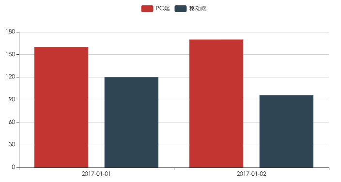

Get Start
---

echarts-plus 的主旨是为了从数据可视化本身的角度去构建 echarts 最终的图表，用于解决当前 echarts 从数据到 series 的一个繁琐的过程。同时也保留了echarts强大的自定义图表样式。

数据可视化本身其实是将数据属性映射到图表的视觉通道上，所以我们可以通过配置数据中的列到图表中的视觉通道可以快速的得到可视化的图表。

下面是一个简单的示例，看一下分别用echarts和echarts-plus实现有什么区别。

**数据**

| 平台        | 日期           | 收入  |
| ------------- |:-------------:| -----:|
| PC端      | 2017-01-01 | $160 |
| 移动端      | 2017-01-01      |   $102 |
| PC端      | 2017-01-02 | $170 |
| 移动端      | 2017-01-02      |   $96 |

**可视化效果**



**Use Echarts**

```js
var myChart = echarts.init(document.getElementById('main'))
// 指定图表的配置项和数据
var series = _.chain(data).groupBy('platform').map((group, platform) => {
  var d = _.chain(group).sortBy('dt').map('revenue').value()
  return {
    name: platform,
    type: 'bar',
    data: d
  }
}).value()
var option = {
  tooltip: {},
  legend: {
    data: _.map(series, 'name')
  },
  xAxis: {
    data: _.chain(data).sortBy('dt').map('dt').uniq('dt').value() // 这里不严谨，其他数据项有可能出错
  },
  yAxis: {},
  series: series
}
myChart.setOption(option)
```

[Live demo](http://yutingzhao.com/echarts-plus/examples/getstart/echarts.html)

**Use EchartsPlus**

```js
new EChartsPlus(data, {
  coord: 'rect',
  visions: [{
    channel: 'y',
    field: 'revenue'
  }, {
    channel: 'legend',
    field: 'platform'
  }, {
    channel: 'x',
    field: 'dt'
  }]
}).renderTo('main')
```

[Live demo](http://yutingzhao.com/echarts-plus/examples/getstart/echarts-plus.html)

相比echarts，echarts-plus的配置变得更加简单。

更多的信息可以参考[web前端数据可视化实践](https://www.gitbook.com/book/yutingzhao1991/visualization/details)
